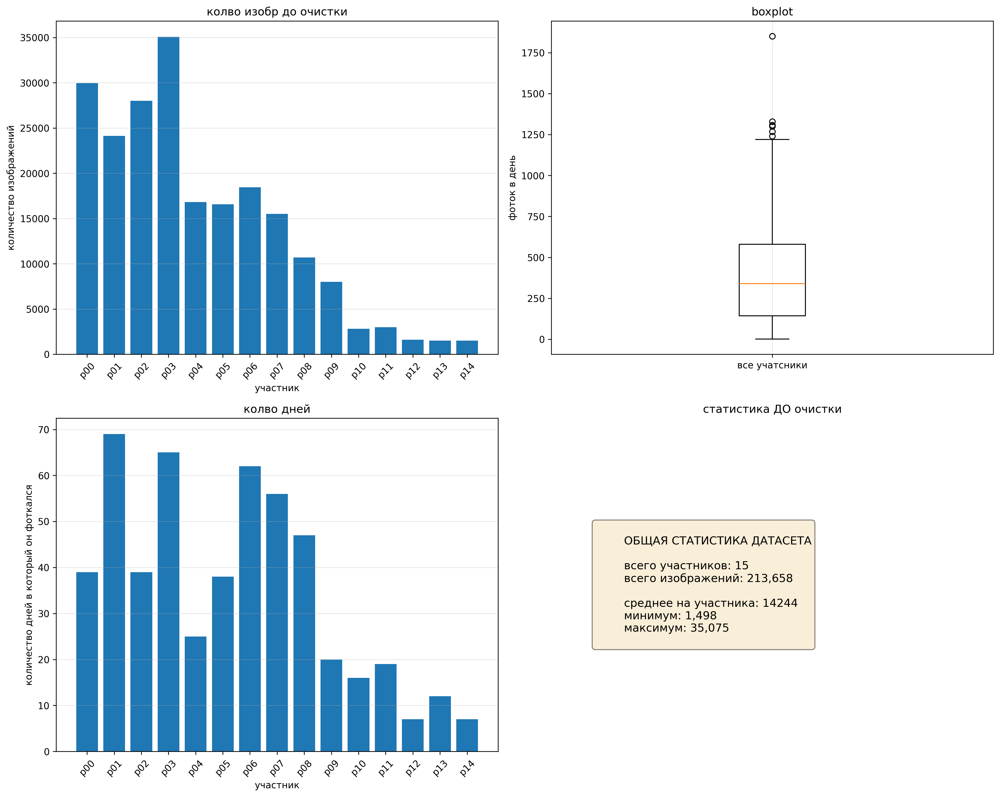
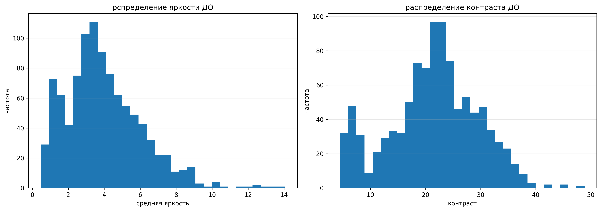
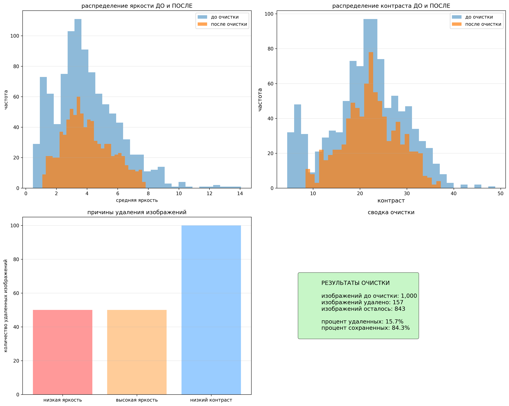

# отчет по анализу датасета MPIIGaze

**дата создания:** 2026-01-27 17:32:33

---

## 1. введение

MPIIGaze dataset that contains 213,659 images that we collected from 15 participants, during natural everyday laptop use over more than three months.## 2. сбор и описание датасета

### 2.1 общая информация

- **количество участников:** 15
- **общее количество фото:** 213,658
- **среднее количество изображений на участника:** 14244

### 2.2 структура датасета

датасет организован по следующей схеме

```
MPIIGaze/
├── Data/
│   ├── Original/
│   │   ├── p00/
│   │   │   ├── day01/
│   │   │   │   ├── 0001.jpg
│   │   │   │   ├── annotation.txt
│   │   │   ├── day02/
│   │   ├── p01/
│   │   ...
│   └── Normalized/
```

## 3. анализ датасета ДО очистки

### 3.1 распределение данных



### 3.2 статистика по участникам

| участник | изображений | дней съемки | среднее/день |
|----------|-------------|-------------|---------------|
| p00 | 29,961 | 39 | 768.2 |
| p01 | 24,143 | 69 | 349.9 |
| p02 | 28,019 | 39 | 718.4 |
| p03 | 35,075 | 65 | 539.6 |
| p04 | 16,831 | 25 | 673.2 |
| p05 | 16,577 | 38 | 436.2 |
| p06 | 18,448 | 62 | 297.5 |
| p07 | 15,509 | 56 | 276.9 |
| p08 | 10,701 | 47 | 227.7 |
| p09 | 7,995 | 20 | 399.8 |
| p10 | 2,810 | 16 | 175.6 |
| p11 | 2,982 | 19 | 156.9 |
| p12 | 1,609 | 7 | 229.9 |
| p13 | 1,498 | 12 | 124.8 |
| p14 | 1,500 | 7 | 214.3 |

### 3.3 качество изображений



**статистика яркости:**
- среднее: 3.98
- медиана: 3.67
- стд. откл.: 2.11
- мин/макс: 0.47 / 14.06

**статистика контраста:**
- среднее: 21.41
- седиана: 21.97
- стд. откл.: 8.04
- мин/сакс: 4.49 / 48.85

## 4. очистка и нормализация датасета

### 4.1 критерии очистки

для удаления изображений низкого качества я применил фильтрацию по критериям:

1. **экстремальная яркость:** с яркостью < 5% и > 95%
2. **низкий контраст:** с контрастом < 10%
3. **дубликаты:**

### 4.2 результаты очистки

- **удалено из-за низкой яркости:** 50
- **удалено из-за высокой яркости:** 50
- **удалено из-за низкого контраста:** 100
- **всего удалено:** 157
- **осталось изображений:** 843

## 5. анализ датасета ПОСЛЕ очистки

### 5.1 сравнение до/после



## 6. технические детали

### 6.1 used libs

- numpy
- pandas
- matplotlib
- seaborn
- opencv2

---

*отчет сгенерирован автоматически*